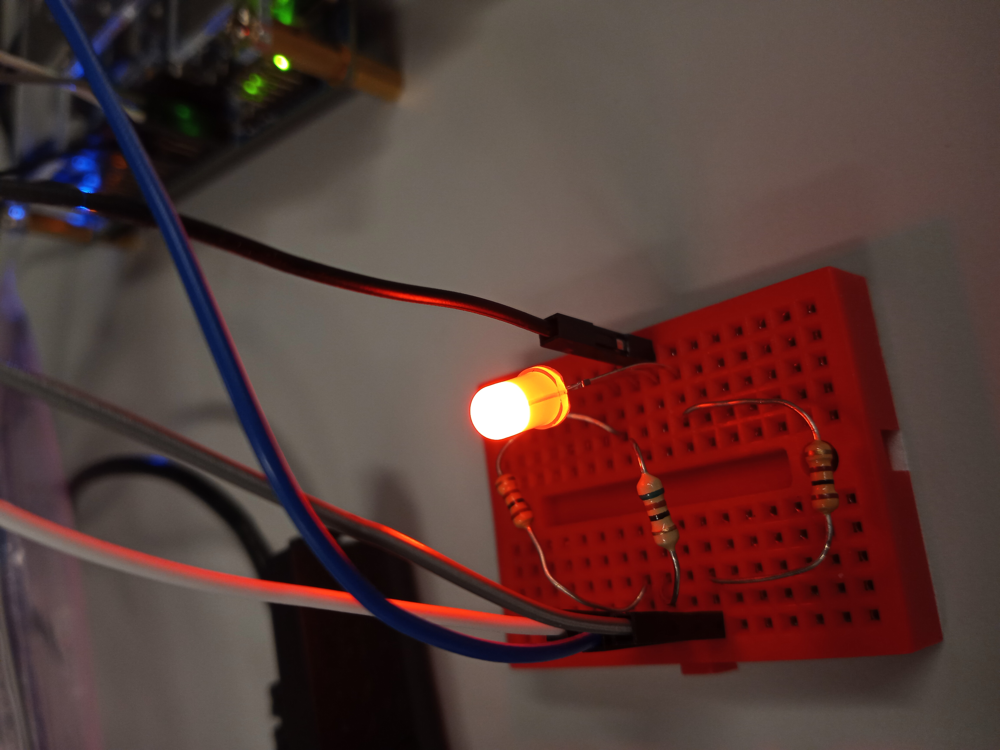
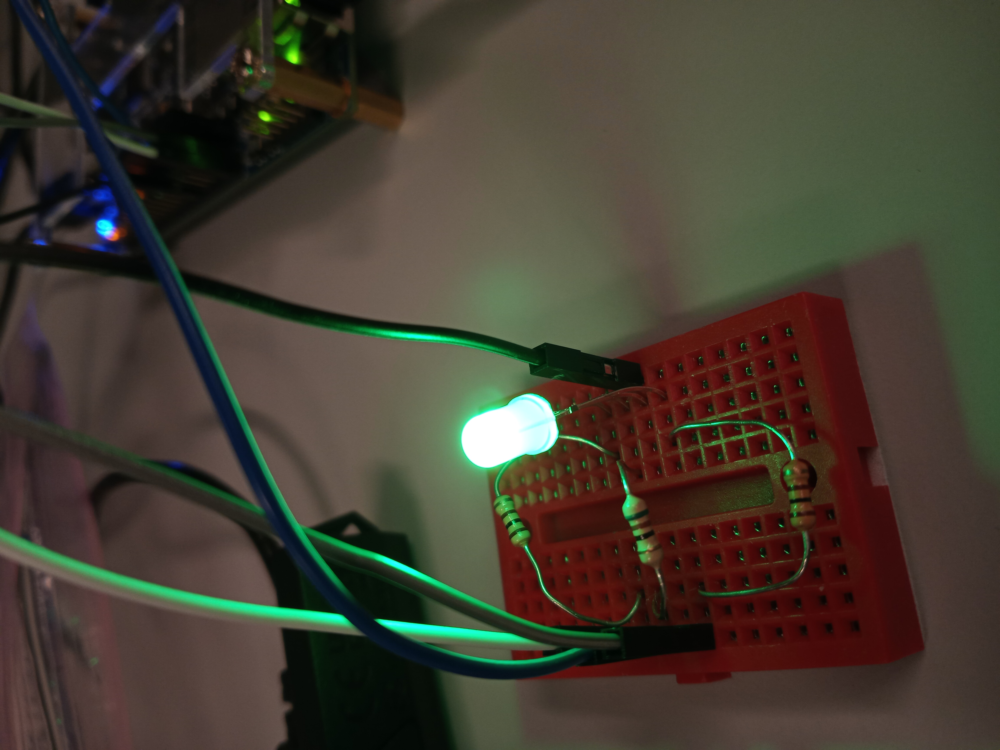
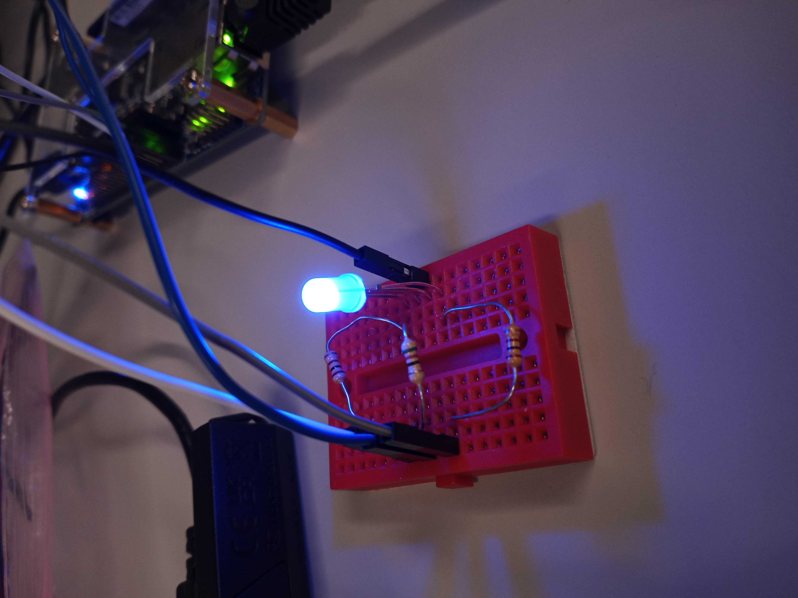
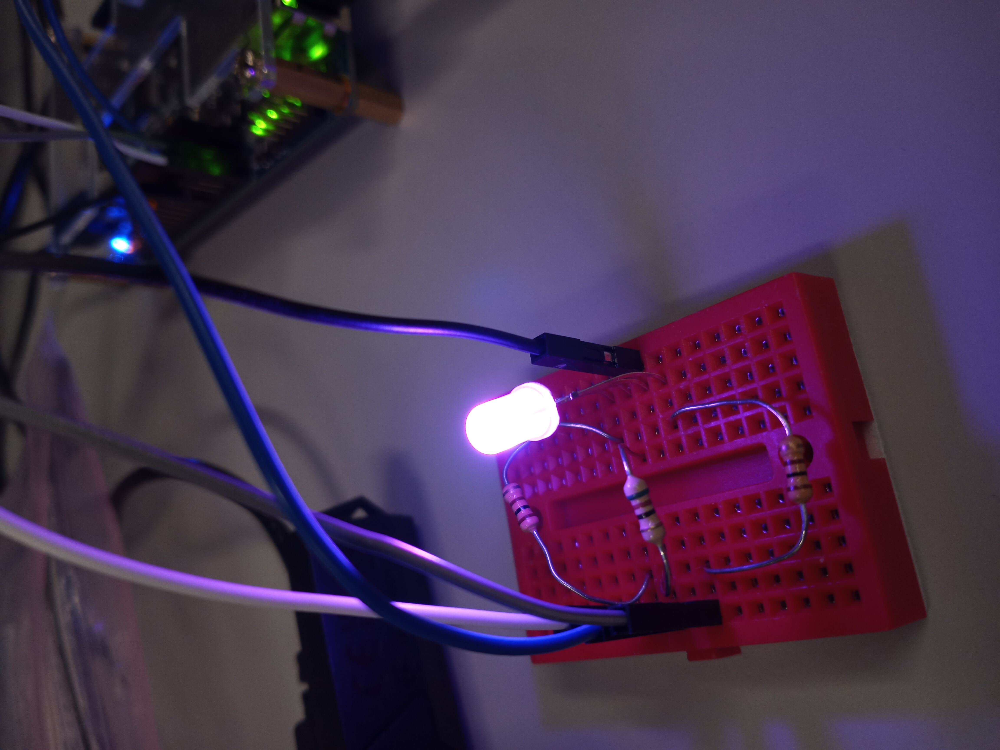

# Homework 10: RGB LED Controller VHDL

## Overview
In this assignment we created an RGB LED controller using the PWM controller from HW9. We created a new RGB controller component in Platform Designer and instantiated it into our design. This allowed us to change the RGB LED color in real time using the system console.

## Deliverables

### Resistance Calculations for the RGB LED:

#### Default Equation

$$ I \ge \frac{V_{cc}-V_{f}}{R} \rightarrow R \ge \frac{V_{cc}-V_{f}}{I} $$

#### Equation for Red Connection:

$$ R_{red} \ge \frac{3.3-2.2}{20 * 10^{-3}} \rightarrow R_{red} \ge 55 $$ 
$$ R_{red} \ge \frac{3.3-2}{20 * 10^{-3}} \rightarrow R_{red} \ge 65 $$
$$ R_{red} \ge 65 \Omega $$

#### Equation for Blue & Green Connection:

$$ R_{bg} \ge \frac{3.3-3.2}{20 * 10^{-3}} \rightarrow R_{bg} \ge 5 $$ 
$$ R_{bg} \ge \frac{3.3-3}{20 * 10^{-3}} \rightarrow R_{bg} \ge 15 $$
$$ R_{bg} \ge 15 \Omega $$

### Pictures of LED:

#### Red LED:

#### Green LED:

#### Blue LED:

#### Magenta LED:

