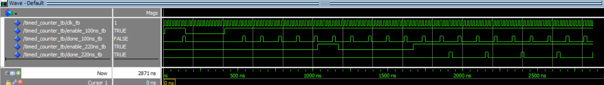
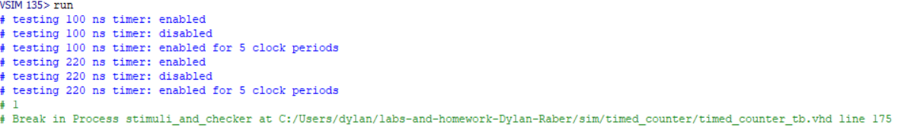

# Homework 4: Timed Counter VHDL

## Overview
In this assignment, we created and tested a timed counter. The timed counter counted for a specific time, and when it reached that time, it would give a done signal before resetting. This assignment will also serve as a good resource for test bench creation as well as generics and how they function between files and port maps. 

## Deliverables

