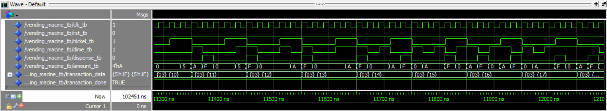
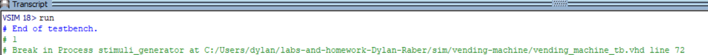

# Homework 5: Vending Machine VHDL

## Overview
In this assignment, we created and tested a simple FSM modeling a vending machine. In my case, I used a two-process state machine to model the vending machine's behavior.

## Deliverables

