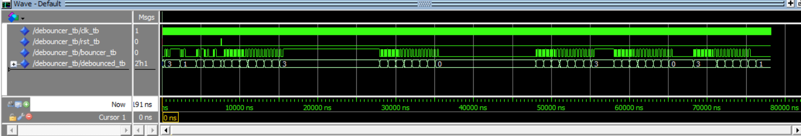
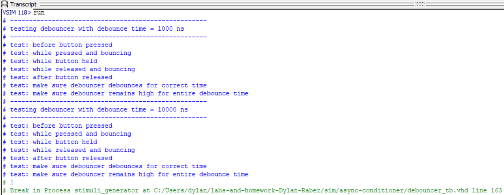
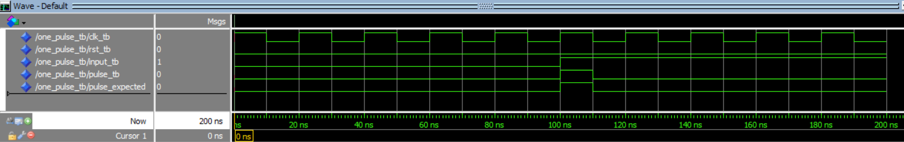
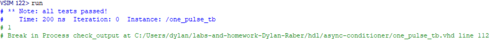
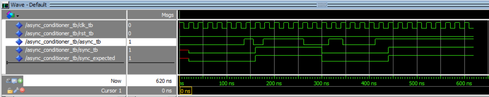
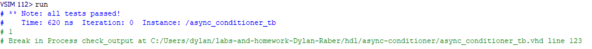

# Homework 6: Async Conditioner

## Overview
In this assignment, we created three new vhdl files. Two were conditioning operations files meant to be used on input signals: one_pulse and debouncer. These files outputted a one clock pulse signal after the incoming signal went high and debounced the incoming signal when being pressed / released respectively. Ther third file combined these two along with a synchronizer file we created for hw3 to create an asynchronous signal conditioner. We also created test benches for the one_pulse file and the overall conditioner. 

## Deliverables
### Debouncer Waveform and Transcript

### One Pulse Waveform and Transcript

### Async Conditioner Waveform and Transcript

