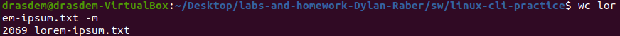
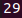
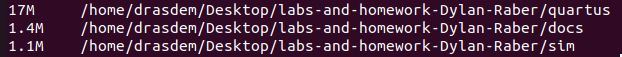

# Homework 7: Linux CLI Practice
## Overview
This homework assignment was made to give us some practice with Linux CLI tools and command-chaining. 
## Deliverables
### Problem 1:
1. `wc lorem-ipsum.txt -w`
2. 
### Problem 2:
1. `wc lorem-ipsum.txt -m`
2. 
### Problem 3:
1. `wc lorem-ipsum.txt -l`
2. 
### Problem 4:
1. `sort file-sizes.txt -h`
2. 
### Problem 5:
1. `sort -h -r file-sizes.txt`
2. 
### Problem 6:
1. `cut -d, -f3 log.csv`
2. 
### Problem 7:
1. `cut -d, -f2,3 log.csv`
2. 
### Problem 8:
1. `cut -d, -f1,4 log.csv`
2. 
### Problem 9:
1. `head -n3 gibberish.txt`
2. 
### Problem 10:
1. `tail -n 2 gibberish.txt`
2. 
### Problem 11:
1. `tail -q log.csv`
2. 
### Problem 12:
1. `grep 'and' gibberish.txt`
2. 
### Problem 13:
1. `grep -n -w 'we' gibberish.txt`
2. 
### Problem 14:
1. `grep -i -Po 'to [a-zA-z]*' gibberish.txt`
2. 
### Problem 15:
1. `grep -c 'FPGAs' fpgas.txt`
2. 
### Problem 16:
1. `grep -P '(ot|er|ile)[.!?,;:]$' fpgas.txt`
2. 
### Problem 17:
1. `find ../../hdl -name "*.vhd" -exec sh -c 'count=$(grep -c "^\s*--" "{}"); echo "{}:$count"' \;`
2. 
### Problem 18:
1. `ls > ls-output.txt` and `cat ls-output.txt`
2. 
### Problem 19:
1. `sudo dmesg | grep "CPU topo"` Note: I ended up using `sudo dmesg | grep "CPU"` instead as the first command returned nothing
2. 
### Problem 20:
1. `find ../../hdl -iname '*vhd' | wc -l`
2. 
### Problem 21:
1. `find ../../hdl -iname '*.vhd' -exec grep '^\s*--' {} \; | wc -l`
2. 
### Problem 22:
1. `grep -n "FPGAs" fpgas.txt | cut -d: -f1`
2. 
### Problem 23:
1. `du -h --max-depth=0 ~/Desktop/labs-and-homework-Dylan-Raber/* | sort -hr | head -n 3`
2. 
 