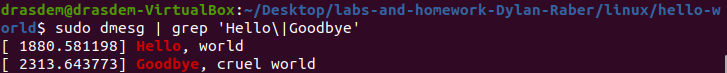
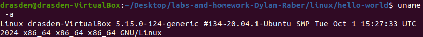
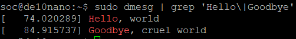
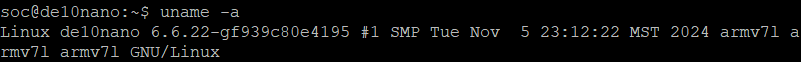

# Homework 8: "Hello World" Linux Kernel Module

## Overview
In this assignment, we...

## Deliverables

### Ubuntu VM Section

#### Kernel Log Buffer

#### Uname Info

#### Modinfo Result

[VM_modinfo](assets/vm_linux_modinfo_hw.png)

### SOC Section

#### Kernel Log Buffer

#### Uname Info

#### Modinfo Result

[SOC_modinfo](assets/soc_linux_modinfo_hw.png)

