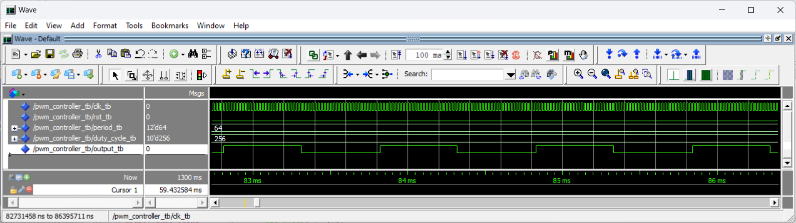
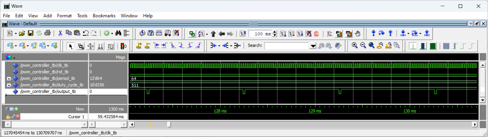
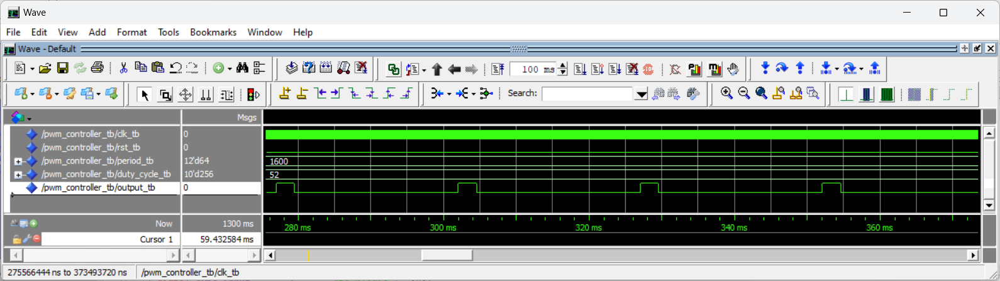
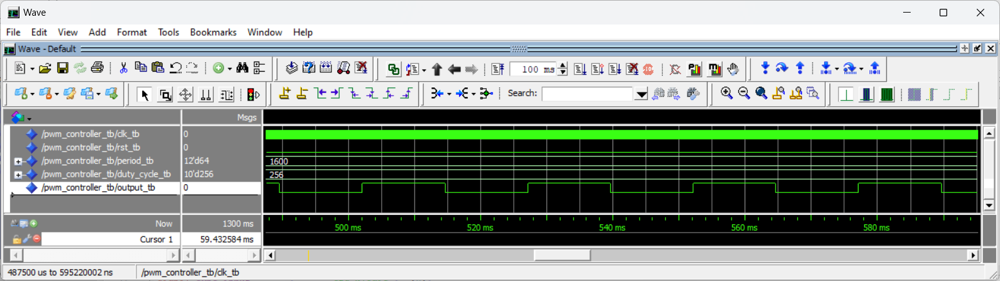

# Homework 9: PWM Controller

## Overview
In this assignment, we created a PWM controller vhd file that will be used in our final project to contorl an RGB LED.

## Deliverables

### Questa Simulation Section

#### PWM = 1 ms with Duty Cycle = 50%

#### PWM = 1 ms with Duty Cycle = 99.8%

#### PWM = 25 ms with Duty Cycle = 10%

#### PWM = 25 ms with Duty Cycle = 50%

### Oscilloscope Section

I planned on working on the oscilloscope section today (11/8) but didn't have time. And since I won't have access to the oscilloscopes in Cobleigh until Tuesday, I figured I'll just turn in what I have now and keep working on it if/when I get the chance. 

