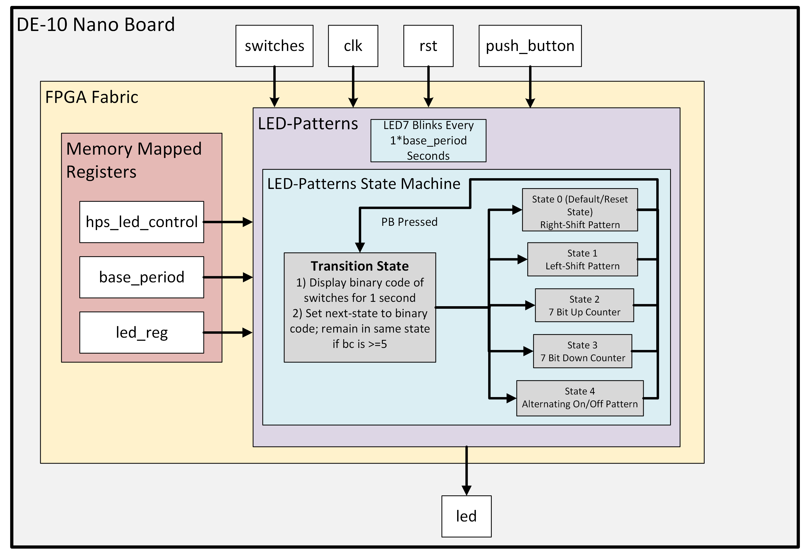

# Lab 4: LED Patterns

## Project Overview
For this lab, we were tasked with creating a program that would create various light patterns using LEDs on the FPGA board. These light patterns would be selected by the FPGA's 4 on-board switches and confirmed via one of the FPGA's buttons. 
### Functional Requirements
For this lab, the ARM HPS software control mode was not required nor recommended, so the LED patterns were instead controlled by FSM. The state machine needed numerous states, with each state controlling a different pattern for the LEDs. Also, the 7th LED (LED_7) was made independent of the rest and the FSM in general to display the patterns' base period and to  make sure it was correct. 
Additionally, the patterns all needed to run at various time rates. Moreover, whenever the state was changed, a state transition period would run for 1 second, displaying the binary code of the new state. After this transition, the new state and its associated pattern would then activate and run until a new state was selected (via the switches) and approved (via the push button). 
Finally, the push button input needed to be conditioned and debounced such that the push button signal would operate synchronously with the FSM's clock cycle. 

## System Architecture
For a description of the LED Pattern's state machine, see the above section on Functional Requirements. Additionally, the image below shows an abstract of the FSM within the "LED-Patterns State Machine" box.

The Block Diagram itself for this lab is not that complicated. Within the LED_Patterns architecture, the only major system we needed to create was the FSM for the LED Patterns. For this lab, the 2 process FSM was split up into 3 main vhd files: led_patterns, pattern_SM, and pattern_behavior. 
For led_patterns, it was the main hub of component instantiation and port mapping of external components like the push button's debouncer or the clock generator for the pattern timings, in addition to providing the trnasition state logic along with the FSM's output logic. 
For pattern_SM, it mainly served as the current_state logic center for the FSM, making sure that the states would switch accordingly and only after the transition state was finished. 
For pattern_behavior, it dealt with all the actual pattern behaviors associated with the various states. It accomplished this using methods like counter loops, bit shifting functions, and inversion functionality.

While there were other components, they dealt with smaller functions of the project like creating a pulse after the transition state or generating the base period's clock. Since their functionality is pretty one-dimensional (and can usually be gleamed by their file name) they won't be talked about here in detail.

## Implementation Details
For the custom LED Pattern, I chose to create the following alternating on off pattern (X = off, O = on): 
XOXOXOX -> 1/8 base_period cycles -> 
OXOXOXO -> 1/8 base_period cycles ->
XOXOXOX -> repeat ad infinitum

Additional implementation details: for whatever reason, my Quartus software does not allow conditional signal assignments, even when VHDL 2008 is selected in the compilation settings. As such, any conditional signal assignment in the sim folder version of this lab's code was changed to if-else statements for Quartus. 