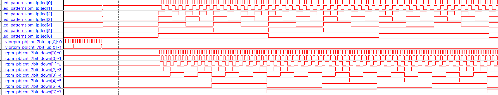

# Lab 5: Signal Tap

## Overview
In this short lab, we were tasked with learning about Quartus' Signal Tap feature, which can be used as an in-house logic analyzer tool for Quartus projects. The probing techniques and debugging opportunities this feature provides will be very useful throughout the semester.

## Deliverables
The following are some screenshots of the stp file interface showing successful signal monitoring of the led's and the various pattern generators. 

Note: for some of my patterns, like pattern 3, the pattern generators could not be displayed fully (they had missing nodes in the nodes list). While this is fine for the purposes of this lab, I'm currently diagnosing the issue such that this won't be a problem later on.

### Pattern 1 Waveform

### Pattern 2 Waveform

### Pattern 3 Waveform

### Pattern 4 Waveform

### Pattern 5 Waveform

## Questions
For my STP file, 13312 bits of on-chip memory were allocated in order to monitor my signals.