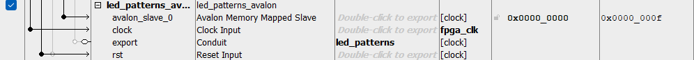

# Lab 6: Creating a Custom Component in Platform Designer

## System Architecture

To give a basic idea of the current systems architecture, let's take a top-down approach:

1. We start off on the De-10 Nano Board, where we get our inputs from our user (for now at least, later on this won't be the only way).
2. We send those inputs through the FPGA fabric, which houses all the hardware code we make in Quartus / Questa.
3. Those inputs are then transferred into the soc_system, an IP Core. This IP core is basically the overall block of logic for our LED_Patterns functionality, which saves the various connections, settings, and other unique program data we need to make things work. This is also where we define our registers, which will be used later on when we have the other source for user input.
4. The inputs are then sent to our led_patterns_avalon subsystem, which controls our register processes like reading and writing. Additionally, it instantiates the LED_Patterns project from Lab4, which allows us to use the De-10 Nano in the same way we did for Project 4 (creating various LED patterns depending upon switch positions and the press of a button).

Below is a block diagram representing the current layout of the project.

## Register Map

For this lab, we needed to create 3 registers for our signals (hps_led_control, base_period, and led_reg). The program decides when to read or write to these registers depending on two separate signals, avs_read and avs_write. If they are asserted, the program looks at the avs_address to determine what register is being read or written to. The following bitfield diagrams illustrate the contents of our 3 registers. 

### led_reg Register

### base_period Register

### hps_led_control Register

Here is a table showing the registers along with their respective addresses in memory.

| Register    | Address |
| -------- | ------- |
| hps  | 0xFF200000    |
| base_period | 0xFF200004     |
| led_reg    | 0xFF200008    |

## Platform Designer

**Question**: How did you connect these registers to the ARM CPUs in the HPS?

**Answer**: The registers were connected to the ARM CPUs via Platform Designer's Connections section in the System Contents menu, which can be seen in the following screengrab:

**Question**: What is the base address of your component in your Platform Designer system?

**Answer**: The base address for my component in my Platformer Designer System is 0x0000_0000, which can be seen in the following screengrab:

